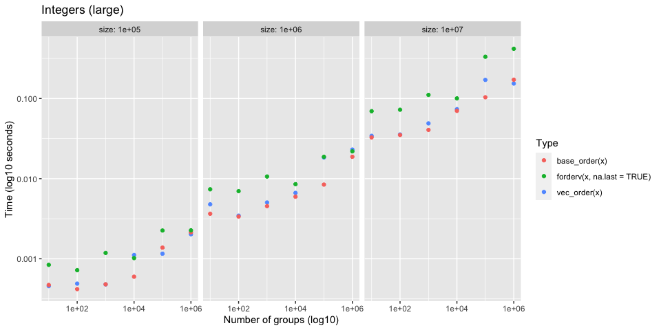
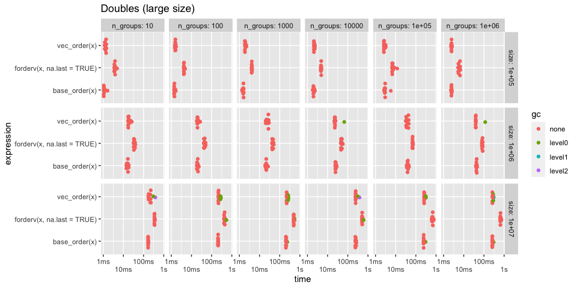
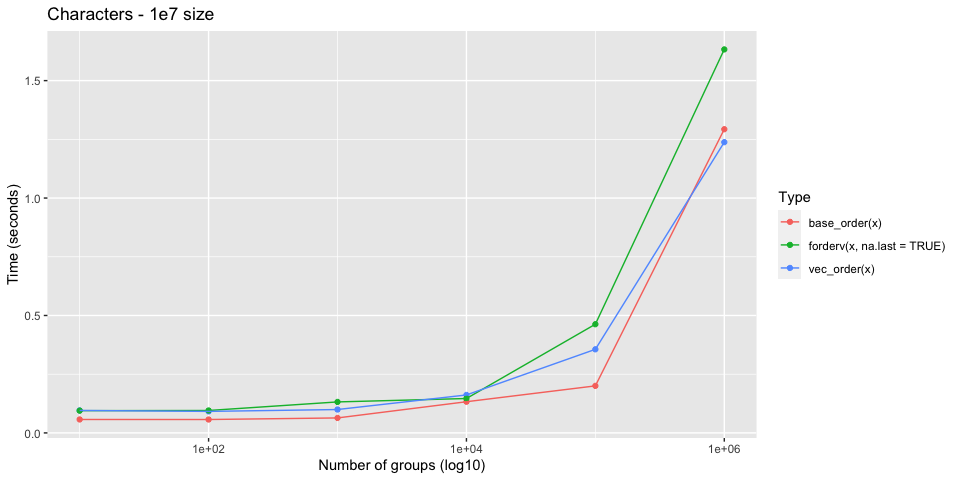
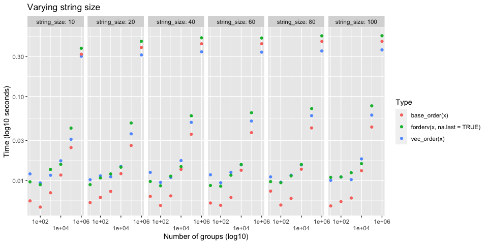

Order performance
================

Investigation of `vec_order()` performance compared with `base::order()`
using various data types and distributions of data (total size, number
of groups, etc).

## Setup

``` r
library(vctrs)
library(rlang)
library(stringr)
library(ggplot2)
library(dplyr)
library(forcats)
library(data.table)

vec_order <- vctrs:::vec_order_radix
forderv <- data.table:::forderv
```

``` r
# Wrapper around `order()` that is also meaningful for data frames and
# always chooses radix ordering
base_order <- function(x, na.last = TRUE, decreasing = FALSE) {
  if (is.data.frame(x)) {
    x <- unname(x)
  } else {
    x <- list(x)
  }

  args <- list(na.last = na.last, decreasing = decreasing, method = "radix")

  args <- c(x, args)

  exec("order", !!!args)
}
```

``` r
# Generate `size` random words of varying string sizes
new_dictionary <- function(size, min_length, max_length) {
  lengths <- rlang::seq2(min_length, max_length)

  stringi::stri_rand_strings(
    size,
    sample(lengths, size = size, replace = TRUE)
  )
}
```

``` r
# Work around bench_expr bug where vectorized attribute isn't being sliced
# https://github.com/r-lib/bench/pull/90

filter_bench <- function(.data, ...) {
  out <- dplyr::mutate(.data, rn = row_number()) %>%
    dplyr::filter(...)
  
  # patch up bench_expr
  which <- out$rn
  desc <- attr(.data$expression, "description")
  attr(out$expression, "description") <- desc[which]
  
  out$rn <- NULL
  
  out
}
```

``` r
plot_bench <- function(df, title = waiver()) {
  df %>%
    ggplot(aes(x = n_groups, y = as.numeric(median))) +
    geom_point(aes(color = as.character(expression))) +
    facet_wrap(~ size, labeller = label_both, nrow = 1) +
    scale_x_log10() +
    scale_y_log10() + 
    labs(
      x = "Number of groups (log10)",
      y = "Time (log10 seconds)",
      color = "Type",
      title = title
    )
}
```

## Integers

The performance of integer sorting is generally the same as `order()`.
The one exception is with nearly sorted integer vectors, where `order()`
does better for some unknown reason. See the “Nearly sorted sequence”
section.

### Test 1

-   Varying total size (small)
-   Varying group size

``` r
set.seed(123)

size <- 10 ^ (1:4)
n_groups <- 10 ^ (1:6)

df <- bench::press(
  size = size,
  n_groups = n_groups,
  {
    x <- sample(n_groups, size, replace = TRUE)
    bench::mark(
      vec_order(x), 
      base_order(x), 
      forderv(x, na.last = TRUE),
      iterations = 50
    )
  }
)
```

We seem to have a small edge when ordering very small vectors, but this
practically won’t make too much of a difference.

<!-- -->

### Test 2

-   Varying total size (large)
-   Varying number of groups

``` r
set.seed(123)

size <- 10 ^ (5:7)
n_groups <- 10 ^ (1:6)

df <- bench::press(
  size = size,
  n_groups = n_groups,
  {
    x <- sample(n_groups, size, replace = TRUE)
    bench::mark(
      vec_order(x), 
      base_order(x), 
      forderv(x, na.last = TRUE),
      iterations = 10
    )
  }
)
```

Performance seems to be generally about the same no matter the size or
number of groups.

<!-- -->

### Test 3

Investigating the performance of switching from the counting sort to the
radix sort. This happens at `INT_ORDER_COUNTING_RANGE_BOUNDARY` which is
100,000.

``` r
set.seed(123)

n_groups <- c(80000, 90000, 99999, 100001, 110000, 120000)
size <- 1e7

df <- bench::press(
  n_groups = n_groups,
  {
    x <- sample(n_groups, size, replace = TRUE)
    bench::mark(
      vec_order(x), 
      base_order(x), 
      forderv(x, na.last = TRUE),
      iterations = 20
    )
  }
)
```

There is a definite jump in performance when initially moving to the
counting sort. Perhaps this boundary isn’t optimal, but it seems to
scale well after the boundary.

``` r
df
#>  # A tibble: 18 x 7
#>     expression                 n_groups      min   median `itr/sec` mem_alloc
#>     <bch:expr>                    <dbl> <bch:tm> <bch:tm>     <dbl> <bch:byt>
#>   1 vec_order(x)                  80000   93.5ms   98.7ms      9.91    38.1MB
#>   2 base_order(x)                 80000   80.1ms   80.8ms     12.1     38.1MB
#>   3 forderv(x, na.last = TRUE)    80000  281.3ms  296.5ms      3.39    38.1MB
#>   4 vec_order(x)                  90000   98.3ms  101.3ms      9.16    38.1MB
#>   5 base_order(x)                 90000   82.4ms   83.5ms     11.3     38.1MB
#>   6 forderv(x, na.last = TRUE)    90000  338.5ms  359.1ms      2.80    38.1MB
#>   7 vec_order(x)                  99999  100.4ms  102.8ms      9.19    38.1MB
#>   8 base_order(x)                 99999   82.8ms   84.5ms     11.7     38.1MB
#>   9 forderv(x, na.last = TRUE)    99999  325.8ms  334.5ms      2.98    38.1MB
#>  10 vec_order(x)                 100001  169.9ms  171.7ms      5.49   162.1MB
#>  11 base_order(x)                100001  150.7ms  156.8ms      6.22    38.1MB
#>  12 forderv(x, na.last = TRUE)   100001  326.8ms  343.2ms      2.93    38.1MB
#>  13 vec_order(x)                 110000  167.5ms  169.9ms      5.81   162.1MB
#>  14 base_order(x)                110000  148.9ms  154.5ms      6.44    38.1MB
#>  15 forderv(x, na.last = TRUE)   110000  316.4ms  324.9ms      3.04    38.1MB
#>  16 vec_order(x)                 120000  164.7ms  171.3ms      5.78   162.1MB
#>  17 base_order(x)                120000    151ms  153.2ms      6.43    38.1MB
#>  18 forderv(x, na.last = TRUE)   120000  305.6ms  315.7ms      3.16    38.1MB
#>  # … with 1 more variable: gc/sec <dbl>
```

<!-- -->

## Doubles

Double performance is overall similar to integers when compared with
`order()`. It is generally slower than ordering integers because a
maximum of 8 passes are required to order a double (8 bytes vs 4 bytes
in integers).

### Test 1

-   Varying total size (small)
-   Varying group size

``` r
set.seed(123)

size <- 10 ^ (1:4)
n_groups <- 10 ^ (1:6)

df <- bench::press(
  size = size,
  n_groups = n_groups,
  {
    x <- sample(n_groups, size, replace = TRUE) + 0
    bench::mark(
      vec_order(x), 
      base_order(x), 
      forderv(x, na.last = TRUE),
      iterations = 50
    )
  }
)
```

Performance is about the same.

<!-- -->

### Test 2

-   Varying total size (large)
-   Varying number of groups

``` r
set.seed(123)

size <- 10 ^ (5:7)
n_groups <- 10 ^ (1:6)

df <- bench::press(
  size = size,
  n_groups = n_groups,
  {
    x <- sample(n_groups, size, replace = TRUE) + 0
    
    bench::mark(
      vec_order(x), 
      base_order(x), 
      forderv(x, na.last = TRUE),
      iterations = 10
    )
  }
)
```

I imagine the increase in gc’s for large sizes comes from the fact that
`vec_order()` uses `Rf_allocVector()` to generate its working memory,
and `base_order()` uses `malloc()`, which won’t trigger a gc.

<!-- -->

<!-- -->

## Characters

I expect to be slightly slower with character vectors, as base R has
access to macros for `TRUELENGTH()` and `LEVELS()` (used to determine
encoding), but we have to call their function equivalents.

There is also an additional component here, the maximum string length.
The longest string in the vector determines how many “passes” are
required in the radix sort. Longer strings mean more passes which
generally takes more time. However, keep in mind that we only radix sort
the unique strings, so this often doesn’t hurt us that much (like in
dplyr where we group on a character column with just a few groups).

### Test 1

-   Varying total size (small)
-   Varying group size
-   String length of 5-20 characters

``` r
set.seed(123)

size <- 10 ^ (1:4)
n_groups <- 10 ^ (1:6)

df <- bench::press(
  size = size,
  n_groups = n_groups,
  {
    dict <- new_dictionary(n_groups, min_length = 5, max_length = 20)
    x <- sample(dict, size, replace = TRUE)
    bench::mark(
      vec_order(x), 
      base_order(x), 
      forderv(x, na.last = TRUE),
      iterations = 50
    )
  }
)
```

<!-- -->

As expected, for small ish sizes we are somewhat slower. This difference
seems to go away as you increase the number of groups.

``` r
df %>%
  mutate(expression = as.character(expression)) %>%
  filter_bench(size == 10000)
#>  # A tibble: 18 x 8
#>     expression       size n_groups      min   median `itr/sec` mem_alloc `gc/sec`
#>     <chr>           <dbl>    <dbl> <bch:tm> <bch:tm>     <dbl> <bch:byt>    <dbl>
#>   1 vec_order(x)    10000       10 112.35µs 120.98µs     8311.   283.7KB     170.
#>   2 base_order(x)   10000       10  78.52µs  82.81µs    11788.    39.1KB       0 
#>   3 forderv(x, na.… 10000       10  87.67µs     89µs    11120.    39.1KB       0 
#>   4 vec_order(x)    10000      100 129.57µs 139.28µs     6967.   283.7KB       0 
#>   5 base_order(x)   10000      100  80.99µs  82.35µs    11902.    39.1KB       0 
#>   6 forderv(x, na.… 10000      100  94.44µs  95.33µs     9874.    39.1KB       0 
#>   7 vec_order(x)    10000     1000 181.46µs  191.9µs     5213.   283.7KB       0 
#>   8 base_order(x)   10000     1000 123.22µs 132.85µs     7402.    39.1KB       0 
#>   9 forderv(x, na.… 10000     1000 294.92µs 303.34µs     3262.    39.1KB       0 
#>  10 vec_order(x)    10000    10000   1.32ms   1.35ms      700.   283.7KB       0 
#>  11 base_order(x)   10000    10000  656.8µs  682.8µs     1456.    39.1KB       0 
#>  12 forderv(x, na.… 10000    10000   1.14ms   1.15ms      832.    39.1KB       0 
#>  13 vec_order(x)    10000   100000 705.07µs  755.7µs     1294.   283.7KB       0 
#>  14 base_order(x)   10000   100000   1.15ms    1.2ms      788.    39.1KB       0 
#>  15 forderv(x, na.… 10000   100000   1.78ms   1.86ms      537.    39.1KB       0 
#>  16 vec_order(x)    10000  1000000   1.04ms   1.21ms      828.   283.7KB       0 
#>  17 base_order(x)   10000  1000000   1.61ms   1.68ms      577.    39.1KB       0 
#>  18 forderv(x, na.… 10000  1000000   2.28ms   2.29ms      418.    39.1KB       0
```

### Test 2

-   Varying total size (large)
-   Varying number of groups
-   String length of 5-20 characters

``` r
set.seed(123)

size <- 10 ^ (5:7)
n_groups <- 10 ^ (1:6)

df <- bench::press(
  size = size,
  n_groups = n_groups,
  {
    dict <- new_dictionary(n_groups, min_length = 5, max_length = 20)
    x <- sample(dict, size, replace = TRUE)
    bench::mark(
      vec_order(x), 
      base_order(x), 
      forderv(x, na.last = TRUE),
      iterations = 10
    )
  }
)
```

Generally about the same once the size gets larger

<!-- -->

Zoom into the size 1e7 section and change to normal seconds (not log
seconds)

As the number of unique strings increases, we have to radix order more
strings. This generally takes more time.

<!-- -->

### Test 3

Very large set of completely random strings

``` r
set.seed(123)

n_groups <- 1e7

x <- new_dictionary(n_groups, min_length = 5, max_length = 20)

bench::mark(
  vec_order(x), 
  base_order(x), 
  forderv(x, na.last = TRUE),
  iterations = 10
)
#>  # A tibble: 3 x 6
#>    expression                      min   median `itr/sec` mem_alloc `gc/sec`
#>    <bch:expr>                 <bch:tm> <bch:tm>     <dbl> <bch:byt>    <dbl>
#>  1 vec_order(x)                  5.27s    5.31s     0.171   547.3MB   0.188 
#>  2 base_order(x)                 4.66s    6.04s     0.169    38.1MB   0.0169
#>  3 forderv(x, na.last = TRUE)    6.31s    6.47s     0.153    38.1MB   0
```

### Test 4

What is the effect of string size on total time?

-   Longer strings generally means more passes are required (one pass
    per character)
-   It is related to number of groups (i.e. number of unique strings) in
    two ways:
    -   Only unique strings are sorted
    -   As soon as it can tell all strings apart it stops

``` r
set.seed(123)

size <- 1e6

n_groups <- 10 ^ (1:6)
string_size <- c(10, 20, 40, 60, 80, 100)

df <- bench::press(
  string_size = string_size,
  n_groups = n_groups,
  {
    dict <- new_dictionary(n_groups, string_size, string_size)
    x <- sample(dict, size, replace = TRUE)
    bench::mark(
      vec_order(x), 
      base_order(x), 
      forderv(x, na.last = TRUE),
      iterations = 10
    )
  }
)
```

The string size doesn’t seem to add too much more time.

<!-- -->

Zoom in to 1e6 groups and varying string size. Here you can see that
there is some effect on total time. Larger maximum string size = more
time required, but it isn’t that bad.

We also seem to consistently do better than `order()` when most of the
strings are unique. My guess is that this is a consequence of the fact
that I store the results of `Rf_length()` on each string (this queries
the nchars of the string) so I don’t have to call that function
repeatedly in the recursive section of the algorithm. `order()` doesn’t
do this. This adds a little memory overhead, but makes up for that in
speed.

<!-- -->

## Completely sorted sequences

Both base and vctrs use a fast check for sortedness up front. For the
very specific case of integer vectors with default options, base has an
even faster sortedness check that beats us, but I’m not too worried
about it. It can also return an ALTREP sequence, so it doesn’t get hit
with memory overhead.

``` r
x <- 1:1e7 + 0L

# Base is faster (simpler check + ALTREP result)
bench::mark(
  vec_order(x), 
  base_order(x), 
  forderv(x, na.last = TRUE),
  iterations = 50,
  check = FALSE
)
#>  # A tibble: 3 x 6
#>    expression                      min   median `itr/sec` mem_alloc `gc/sec`
#>    <bch:expr>                 <bch:tm> <bch:tm>     <dbl> <bch:byt>    <dbl>
#>  1 vec_order(x)                25.47ms  26.29ms      37.5    38.1MB    2.40 
#>  2 base_order(x)                5.51ms   6.37ms     159.         0B    0    
#>  3 forderv(x, na.last = TRUE)  70.42ms  72.33ms      13.8    38.1MB    0.573

# But tweak some options and it becomes closer
bench::mark(
  vec_order(x, direction = "desc", na_value = "smallest"), 
  base_order(x, decreasing = TRUE, na.last = FALSE),
  forderv(x, order = -1L, na.last = FALSE),
  iterations = 50
)
#>  # A tibble: 3 x 6
#>    expression                                                   min   median
#>    <bch:expr>                                              <bch:tm> <bch:tm>
#>  1 vec_order(x, direction = "desc", na_value = "smallest")   19.3ms   20.8ms
#>  2 base_order(x, decreasing = TRUE, na.last = FALSE)         13.9ms   14.5ms
#>  3 forderv(x, order = -1L, na.last = FALSE)                 826.5ms  847.9ms
#>  # … with 3 more variables: itr/sec <dbl>, mem_alloc <bch:byt>, gc/sec <dbl>
```

## Nearly sorted sequence

Nearly sorted integer vectors is one case where base does a little
better than we do for some reason. I can’t seem to figure out why. But
it doesn’t ever seem to be a dramatic difference.

``` r
x <- c(1:1e7, 1:20) + 0L

bench::mark(
  vec_order(x), 
  base_order(x), 
  forderv(x, na.last = TRUE),
  iterations = 20
)
#>  # A tibble: 3 x 6
#>    expression                      min   median `itr/sec` mem_alloc `gc/sec`
#>    <bch:expr>                 <bch:tm> <bch:tm>     <dbl> <bch:byt>    <dbl>
#>  1 vec_order(x)                173.9ms  179.3ms      5.44   162.1MB    0.960
#>  2 base_order(x)               153.5ms  157.6ms      6.35    38.1MB    0    
#>  3 forderv(x, na.last = TRUE)   86.1ms   95.7ms     10.5     38.1MB    0.552
```

The performance difference goes away (for the most part) with doubles

``` r
x <- c(1:1e7, 1:20) + 0

bench::mark(
  vec_order(x), 
  base_order(x), 
  forderv(x, na.last = TRUE),
  iterations = 10
)
#>  # A tibble: 3 x 6
#>    expression                      min   median `itr/sec` mem_alloc `gc/sec`
#>    <bch:expr>                 <bch:tm> <bch:tm>     <dbl> <bch:byt>    <dbl>
#>  1 vec_order(x)                  305ms    313ms      3.06   238.4MB    0.765
#>  2 base_order(x)                 276ms    281ms      3.55    38.1MB    0    
#>  3 forderv(x, na.last = TRUE)    290ms    293ms      3.27    38.1MB    0.363
```

## Multiple columns

It is also worth comparing with multiple columns, since this is what a
group by would typically do.

### Test 1

-   Large size
-   Col 1 - Integer vector of 20 groups
-   Col 2 - Integer vector of 100 groups

This uses a counting sort for both since the ranges are small

Performance is around the same.

``` r
set.seed(123)

size <- 1e7

n_groups1 <- 20
n_groups2 <- 100

df <- data.frame(
  x = sample(n_groups1, size, replace = TRUE),
  y = sample(n_groups2, size, replace = TRUE)
)

bench::mark(
  vec_order(df), 
  base_order(df), 
  forderv(df, na.last = TRUE),
  iterations = 10
)
#>  # A tibble: 3 x 6
#>    expression                       min   median `itr/sec` mem_alloc `gc/sec`
#>    <bch:expr>                  <bch:tm> <bch:tm>     <dbl> <bch:byt>    <dbl>
#>  1 vec_order(df)                  105ms    118ms      8.58   114.8MB    0.953
#>  2 base_order(df)                 143ms    144ms      6.96    38.1MB    0.773
#>  3 forderv(df, na.last = TRUE)    128ms    132ms      7.46    38.1MB    0
```

### Test 2a

-   Large size
-   Col 1 - Double vector of 20 groups
-   Col 2 - Double vector of 100 groups

This uses a radix sort for both since there is no counting sort for
doubles.

Performance is around the same.

``` r
set.seed(123)

size <- 1e7

n_groups1 <- 20
n_groups2 <- 100

df <- data.frame(
  x = sample(n_groups1, size, replace = TRUE) + 0,
  y = sample(n_groups2, size, replace = TRUE) + 0
)

bench::mark(
  vec_order(df), 
  base_order(df), 
  forderv(df, na.last = TRUE),
  iterations = 10
)
#>  # A tibble: 3 x 6
#>    expression                       min   median `itr/sec` mem_alloc `gc/sec`
#>    <bch:expr>                  <bch:tm> <bch:tm>     <dbl> <bch:byt>    <dbl>
#>  1 vec_order(df)               416.68ms 432.73ms     2.33    238.8MB    0.997
#>  2 base_order(df)              449.04ms 456.54ms     2.19     38.1MB    0.244
#>  3 forderv(df, na.last = TRUE)    1.09s    1.13s     0.875    38.1MB    0
```

### Test 2b

Like test 2a, but the doubles groups are very spread out.

We tend to do much better here, but I am not entirely sure why.

``` r
set.seed(123)

size <- 1e7

n_groups1 <- 20
n_groups2 <- 100

dict1 <- sample(1e15, n_groups1)
dict2 <- sample(1e15, n_groups2)

df <- data.frame(
  x = sample(dict1, size, replace = TRUE) + 0,
  y = sample(dict2, size, replace = TRUE) + 0
)

bench::mark(
  vec_order(df), 
  base_order(df), 
  forderv(df, na.last = TRUE),
  iterations = 10
)
#>  # A tibble: 3 x 6
#>    expression                       min   median `itr/sec` mem_alloc `gc/sec`
#>    <bch:expr>                  <bch:tm> <bch:tm>     <dbl> <bch:byt>    <dbl>
#>  1 vec_order(df)               536.19ms 546.05ms     1.80    238.8MB    0.449
#>  2 base_order(df)              909.29ms 924.68ms     1.08     38.1MB    0    
#>  3 forderv(df, na.last = TRUE)    1.35s    1.42s     0.703    38.1MB    0
```

### Test 3a

20 integer columns, each with 2 groups. 1e6 total size.

There end up being around 64,000 unique rows

Performance is about the same

``` r
set.seed(123)

size <- 1e6L
n_groups <- 2
n_cols <- 20

cols <- replicate(n_cols, sample(n_groups, size, TRUE), simplify = FALSE)
names(cols) <- seq_along(cols)
df <- vctrs::new_data_frame(cols, size)

bench::mark(
  vec_order(df), 
  base_order(df), 
  forderv(df, na.last = TRUE),
  iterations = 10
)
#>  # A tibble: 3 x 6
#>    expression                       min   median `itr/sec` mem_alloc `gc/sec`
#>    <bch:expr>                  <bch:tm> <bch:tm>     <dbl> <bch:byt>    <dbl>
#>  1 vec_order(df)                  176ms    183ms      5.49   19.84MB        0
#>  2 base_order(df)                 172ms    179ms      5.57    3.82MB        0
#>  3 forderv(df, na.last = TRUE)    104ms    107ms      9.28    3.81MB        0
```

### Test 3b

Same as before but with character columns. We do slightly worse here.

``` r
set.seed(123)

size <- 1e6L
n_groups <- 2
n_cols <- 20

cols <- replicate(
  n_cols, 
  {
    dict <- new_dictionary(n_groups, 5, 10)
    sample(dict, size, TRUE)
  }, 
  simplify = FALSE
)

names(cols) <- seq_along(cols)
df <- vctrs::new_data_frame(cols, size)

bench::mark(
  vec_order(df), 
  base_order(df), 
  forderv(df, na.last = TRUE),
  iterations = 10
)
#>  # A tibble: 3 x 6
#>    expression                       min   median `itr/sec` mem_alloc `gc/sec`
#>    <bch:expr>                  <bch:tm> <bch:tm>     <dbl> <bch:byt>    <dbl>
#>  1 vec_order(df)                  383ms    399ms      2.51   32.39MB        0
#>  2 base_order(df)                 260ms    266ms      3.76    3.82MB        0
#>  3 forderv(df, na.last = TRUE)    153ms    155ms      6.43    3.81MB        0
```
